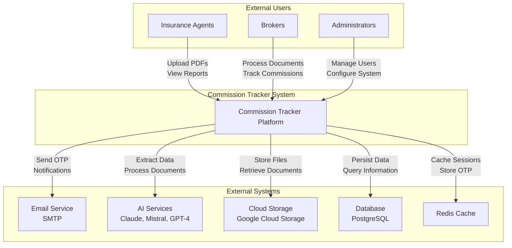
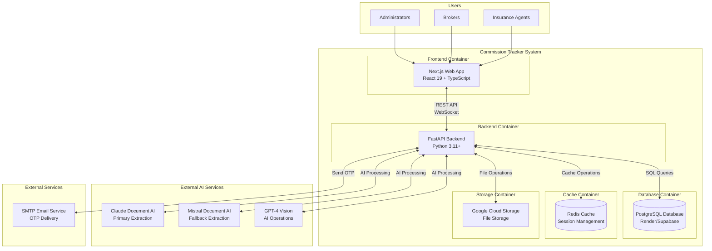
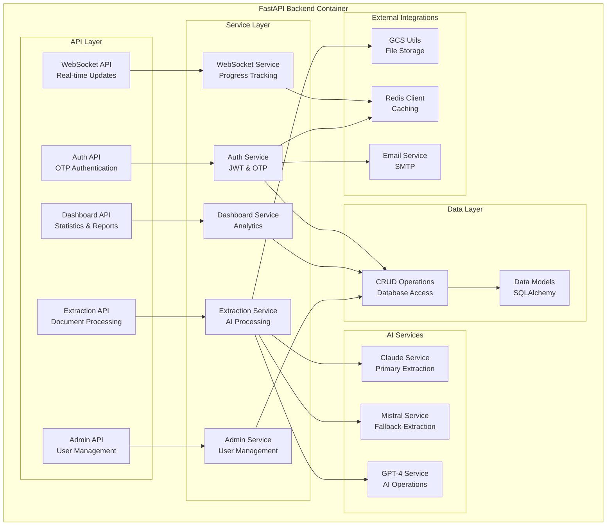
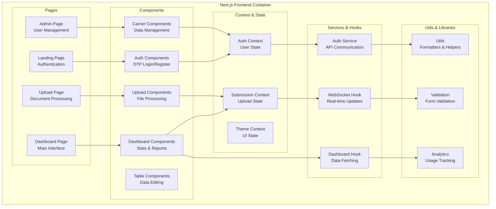
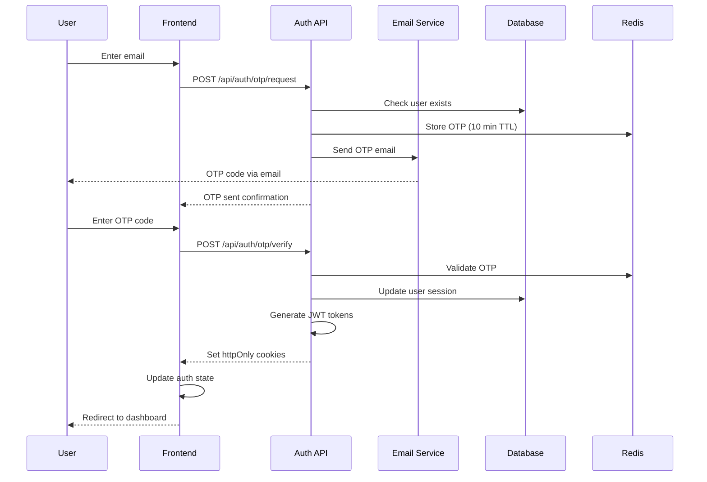
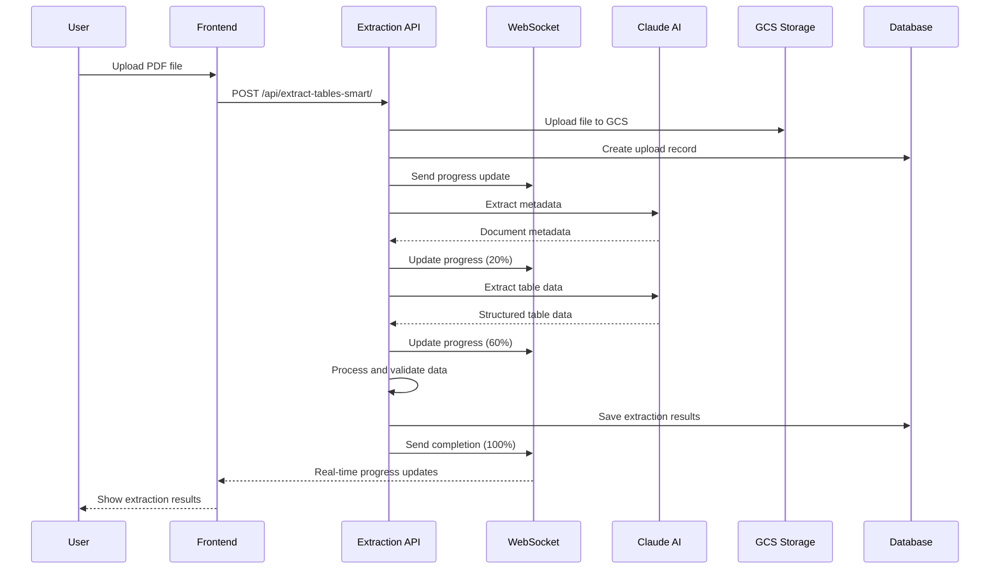

# C4 Models Documentation - Commission Tracker

## Overview

Commission Tracker is a professional SaaS platform for financial document processing and commission tracking with AI-powered data extraction capabilities.

## What is the C4 Model?

The **C4 Model** (Context, Containers, Components, Code) is a software architecture documentation methodology developed by Simon Brown. It provides a structured way to visualize and communicate software system architecture to different audiences, from high-level stakeholders to developers.

### The 4 Levels of the C4 Model:

1. **System Context (Level 1)**: Shows how the system fits into the real world, identifying users and external systems
2. **Containers (Level 2)**: Breaks down the system into high-level containers (applications, databases, etc.)
3. **Components (Level 3)**: Breaks down each container into its main components
4. **Code (Level 4)**: Shows implementation details of specific components

### In Our Commission Tracker System

This documentation uses the C4 Model to represent the complete architecture of **Commission Tracker**, a professional SaaS platform for financial document processing and commission tracking with AI-powered data extraction capabilities.

The C4 diagrams allow us to:
- **Visualize** the system architecture in a clear and understandable way
- **Communicate** the system structure to different audiences (developers, stakeholders, new team members)
- **Document** relationships between components and external dependencies
- **Facilitate** architectural decision-making and system maintenance

## Level 1: System Context

### System Context Description

**Primary Users:**
- **Insurance Agents**: Upload commission documents, review extracted data, configure field mappings
- **Brokers**: Process multiple documents, generate commission reports, manage clients
- **Administrators**: Manage users, configure allowed domains, supervise the system

**External Dependencies:**
- **Email Service (SMTP)**: OTP code delivery and notifications
- **AI Services**: Claude Document AI (primary extraction), Mistral (fallback), GPT-4 (AI operations)
- **Cloud Storage (GCS)**: PDF file storage and processed documents
- **Database (PostgreSQL)**: User data, companies, extractions and commissions persistence
- **Redis Cache**: Session management and temporary OTP storage

## Level 2: Container Diagram

### Container Descriptions

**Frontend Container (Next.js Web App)**
- **Technology**: Next.js 15, React 19, TypeScript, Tailwind CSS
- **Responsibilities**: 
  - User interface for document upload
  - Extracted data visualization
  - Field mapping management
  - Reports and dashboards
  - OTP authentication
- **Key Components**: Dashboard, Carrier Management, Upload Zone, Table Editor

**Backend Container (FastAPI Backend)**
- **Technology**: FastAPI, Python 3.11+, SQLAlchemy, Pydantic
- **Responsibilities**:
  - REST API for CRUD operations
  - AI-powered document processing
  - Authentication and authorization
  - WebSocket for real-time updates
  - External service integration
- **Key Modules**: Auth, Extraction, Dashboard, Admin, WebSocket

**Database Container (PostgreSQL)**
- **Technology**: PostgreSQL with asyncpg
- **Responsibilities**:
  - User and company data storage
  - Extraction metadata
  - Field mapping configurations
  - Processed commission data
- **Key Tables**: users, companies, statement_uploads, extractions, earned_commissions

## Level 3: Component Diagram - Backend API# C4 Models Documentation - Commission Tracker

## Overview

Commission Tracker is a professional SaaS platform for financial document processing and commission tracking with AI-powered data extraction capabilities.

## Level 1: System Context

### System Context Description

**Primary Users:**
- **Insurance Agents**: Upload commission documents, review extracted data, configure field mappings
- **Brokers**: Process multiple documents, generate commission reports, manage clients
- **Administrators**: Manage users, configure allowed domains, supervise the system

**External Dependencies:**
- **Email Service (SMTP)**: OTP code delivery and notifications
- **AI Services**: Claude Document AI (primary extraction), Mistral (fallback), GPT-4 (AI operations)
- **Cloud Storage (GCS)**: PDF file storage and processed documents
- **Database (PostgreSQL)**: User data, companies, extractions and commissions persistence
- **Redis Cache**: Session management and temporary OTP storage

## Level 2: Container Diagram

### Container Descriptions

**Frontend Container (Next.js Web App)**
- **Technology**: Next.js 15, React 19, TypeScript, Tailwind CSS
- **Responsibilities**: 
  - User interface for document upload
  - Extracted data visualization
  - Field mapping management
  - Reports and dashboards
  - OTP authentication
- **Key Components**: Dashboard, Carrier Management, Upload Zone, Table Editor

**Backend Container (FastAPI Backend)**
- **Technology**: FastAPI, Python 3.11+, SQLAlchemy, Pydantic
- **Responsibilities**:
  - REST API for CRUD operations
  - AI-powered document processing
  - Authentication and authorization
  - WebSocket for real-time updates
  - External service integration
- **Key Modules**: Auth, Extraction, Dashboard, Admin, WebSocket

**Database Container (PostgreSQL)**
- **Technology**: PostgreSQL with asyncpg
- **Responsibilities**:
  - User and company data storage
  - Extraction metadata
  - Field mapping configurations
  - Processed commission data
- **Key Tables**: users, companies, statement_uploads, extractions, earned_commissions

## Level 3: Component Diagram - Backend API

### Backend Component Descriptions

**API Layer:**
- **Auth API**: OTP authentication handling, login/logout, session management
- **Extraction API**: Document processing endpoints, table extraction, field mapping
- **Dashboard API**: Statistics, commission reports, analytical data
- **Admin API**: User management, allowed domains, system configurations
- **WebSocket API**: Real-time communication for extraction progress

**Service Layer:**
- **Auth Service**: Authentication logic, JWT generation, OTP validation
- **Extraction Service**: Document processing orchestration with multiple AI services
- **Dashboard Service**: Statistics calculations, commission data aggregations
- **Admin Service**: User management, permissions, configurations
- **WebSocket Service**: WebSocket connection management, progress notifications

**AI Services:**
- **Claude Service**: Primary extraction using Claude Document AI (superior accuracy)
- **Mistral Service**: Fallback extraction using Mistral Document AI
- **GPT-4 Service**: AI operations for field mapping, plan type detection

## Level 3: Component Diagram - Frontend

### Frontend Component Descriptions

**Pages:**
- **Landing Page**: Homepage with OTP authentication
- **Dashboard Page**: Main interface with statistics and navigation
- **Upload Page**: Document processing with real-time progress
- **Admin Page**: User management and configurations (admin only)

**Components:**
- **Auth Components**: OTP login/registration forms
- **Dashboard Components**: Statistics cards, charts, modals
- **Upload Components**: Upload zone, table editor, field mapping
- **Carrier Components**: Carrier management, data visualization
- **Table Components**: Table editor, data validation

**Context & State:**
- **Auth Context**: User state, permissions, authentication
- **Submission Context**: Upload state, extraction progress
- **Theme Context**: Interface theme, user preferences

## Level 4: Code Diagram - Authentication Flow

## Level 4: Code Diagram - Document Processing Flow

## Technology Stack

### Frontend Technologies
- **Framework**: Next.js 15 (React 19)
- **Language**: TypeScript
- **Styling**: Tailwind CSS
- **State Management**: React Context API
- **HTTP Client**: Axios
- **Real-time**: WebSocket
- **PDF Processing**: PDF.js, react-pdf-viewer
- **Charts**: Chart.js, Recharts
- **UI Components**: Radix UI, Lucide React

### Backend Technologies
- **Framework**: FastAPI
- **Language**: Python 3.11+
- **Database ORM**: SQLAlchemy (async)
- **Database**: PostgreSQL (Render/Supabase)
- **Cache**: Redis
- **Authentication**: JWT + OTP
- **File Storage**: Google Cloud Storage
- **AI Services**: Claude Document AI, Mistral, GPT-4
- **PDF Processing**: PyMuPDF, pdfplumber, Docling
- **Email**: SMTP (aiosmtplib)

### Infrastructure
- **Frontend Hosting**: Vercel
- **Backend Hosting**: Render
- **Database**: PostgreSQL (Render/Supabase)
- **File Storage**: Google Cloud Storage
- **Cache**: Redis
- **Containerization**: Docker

## Key Features

### Document Processing
- **Multi-format Support**: PDF, Excel (XLSX, XLS, XLSM, XLSB)
- **AI-Powered Extraction**: Claude Document AI (primary), Mistral (fallback)
- **Real-time Progress**: WebSocket updates during processing
- **Intelligent Mapping**: Automatic field mapping with AI assistance
- **Quality Validation**: Confidence scoring and data validation

### User Management
- **OTP Authentication**: Secure email-based authentication
- **Role-based Access**: Admin, User, Read-only roles
- **Domain Whitelisting**: Company-specific access control
- **Session Management**: JWT tokens with automatic refresh

### Data Management
- **Commission Tracking**: Monthly breakdowns and analytics
- **Carrier Management**: Multiple insurance carrier support
- **Field Mapping**: Customizable field configurations per company
- **Duplicate Detection**: SHA-256 hash-based duplicate prevention

### Analytics & Reporting
- **Dashboard Analytics**: Real-time statistics and KPIs
- **Commission Reports**: Monthly and yearly commission tracking
- **Data Visualization**: Interactive charts and graphs
- **Export Capabilities**: Data export in multiple formats

## Security Features

- **HTTP-Only Cookies**: Secure token storage
- **CORS Configuration**: Cross-origin request security
- **Rate Limiting**: API endpoint protection
- **Input Validation**: Pydantic model validation
- **SQL Injection Prevention**: SQLAlchemy ORM protection
- **File Type Validation**: Secure file upload handling
- **Session Timeout**: Automatic session expiration

## Performance Optimizations

- **Async Processing**: Non-blocking I/O operations
- **Connection Pooling**: Database connection optimization
- **Caching**: Redis for session and OTP storage
- **File Streaming**: Efficient large file handling
- **Progress Tracking**: Real-time user feedback
- **Timeout Management**: Configurable timeouts for long operations

---

*This C4 models documentation provides a comprehensive view of the Commission Tracker system architecture, from system context to specific implementation details.*

### Backend Component Descriptions

**API Layer:**
- **Auth API**: OTP authentication handling, login/logout, session management
- **Extraction API**: Document processing endpoints, table extraction, field mapping
- **Dashboard API**: Statistics, commission reports, analytical data
- **Admin API**: User management, allowed domains, system configurations
- **WebSocket API**: Real-time communication for extraction progress

**Service Layer:**
- **Auth Service**: Authentication logic, JWT generation, OTP validation
- **Extraction Service**: Document processing orchestration with multiple AI services
- **Dashboard Service**: Statistics calculations, commission data aggregations
- **Admin Service**: User management, permissions, configurations
- **WebSocket Service**: WebSocket connection management, progress notifications

**AI Services:**
- **Claude Service**: Primary extraction using Claude Document AI (superior accuracy)
- **Mistral Service**: Fallback extraction using Mistral Document AI
- **GPT-4 Service**: AI operations for field mapping, plan type detection

## Level 3: Component Diagram - Frontend

### Frontend Component Descriptions

**Pages:**
- **Landing Page**: Homepage with OTP authentication
- **Dashboard Page**: Main interface with statistics and navigation
- **Upload Page**: Document processing with real-time progress
- **Admin Page**: User management and configurations (admin only)

**Components:**
- **Auth Components**: OTP login/registration forms
- **Dashboard Components**: Statistics cards, charts, modals
- **Upload Components**: Upload zone, table editor, field mapping
- **Carrier Components**: Carrier management, data visualization
- **Table Components**: Table editor, data validation

**Context & State:**
- **Auth Context**: User state, permissions, authentication
- **Submission Context**: Upload state, extraction progress
- **Theme Context**: Interface theme, user preferences

## Level 4: Code Diagram - Authentication Flow

## Level 4: Code Diagram - Document Processing Flow

## Technology Stack

### Frontend Technologies
- **Framework**: Next.js 15 (React 19)
- **Language**: TypeScript
- **Styling**: Tailwind CSS
- **State Management**: React Context API
- **HTTP Client**: Axios
- **Real-time**: WebSocket
- **PDF Processing**: PDF.js, react-pdf-viewer
- **Charts**: Chart.js, Recharts
- **UI Components**: Radix UI, Lucide React

### Backend Technologies
- **Framework**: FastAPI
- **Language**: Python 3.11+
- **Database ORM**: SQLAlchemy (async)
- **Database**: PostgreSQL (Render/Supabase)
- **Cache**: Redis
- **Authentication**: JWT + OTP
- **File Storage**: Google Cloud Storage
- **AI Services**: Claude Document AI, Mistral, GPT-4
- **PDF Processing**: PyMuPDF, pdfplumber, Docling
- **Email**: SMTP (aiosmtplib)

### Infrastructure
- **Frontend Hosting**: Vercel
- **Backend Hosting**: Render
- **Database**: PostgreSQL (Render/Supabase)
- **File Storage**: Google Cloud Storage
- **Cache**: Redis
- **Containerization**: Docker

## Key Features

### Document Processing
- **Multi-format Support**: PDF, Excel (XLSX, XLS, XLSM, XLSB)
- **AI-Powered Extraction**: Claude Document AI (primary), Mistral (fallback)
- **Real-time Progress**: WebSocket updates during processing
- **Intelligent Mapping**: Automatic field mapping with AI assistance
- **Quality Validation**: Confidence scoring and data validation

### User Management
- **OTP Authentication**: Secure email-based authentication
- **Role-based Access**: Admin, User, Read-only roles
- **Domain Whitelisting**: Company-specific access control
- **Session Management**: JWT tokens with automatic refresh

### Data Management
- **Commission Tracking**: Monthly breakdowns and analytics
- **Carrier Management**: Multiple insurance carrier support
- **Field Mapping**: Customizable field configurations per company
- **Duplicate Detection**: SHA-256 hash-based duplicate prevention

### Analytics & Reporting
- **Dashboard Analytics**: Real-time statistics and KPIs
- **Commission Reports**: Monthly and yearly commission tracking
- **Data Visualization**: Interactive charts and graphs
- **Export Capabilities**: Data export in multiple formats

## Security Features

- **HTTP-Only Cookies**: Secure token storage
- **CORS Configuration**: Cross-origin request security
- **Rate Limiting**: API endpoint protection
- **Input Validation**: Pydantic model validation
- **SQL Injection Prevention**: SQLAlchemy ORM protection
- **File Type Validation**: Secure file upload handling
- **Session Timeout**: Automatic session expiration

## Performance Optimizations

- **Async Processing**: Non-blocking I/O operations
- **Connection Pooling**: Database connection optimization
- **Caching**: Redis for session and OTP storage
- **File Streaming**: Efficient large file handling
- **Progress Tracking**: Real-time user feedback
- **Timeout Management**: Configurable timeouts for long operations

---

*This C4 models documentation provides a comprehensive view of the Commission Tracker system architecture, from system context to specific implementation details.*
