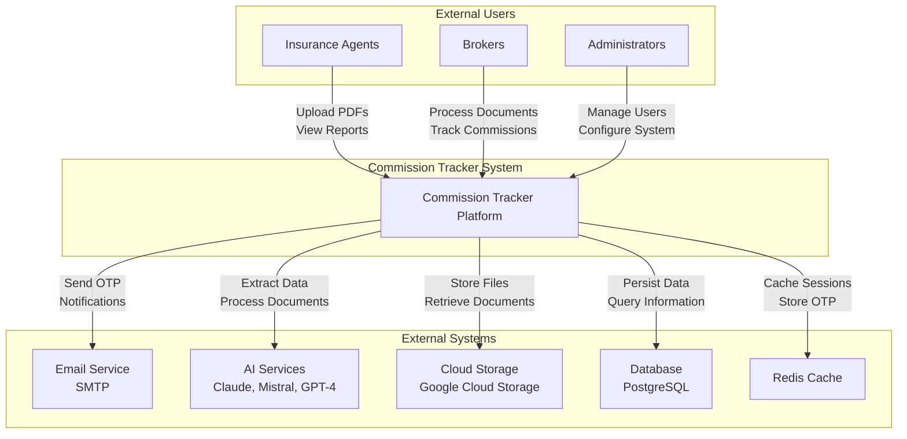
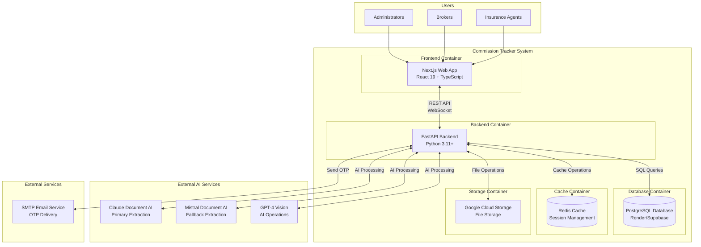
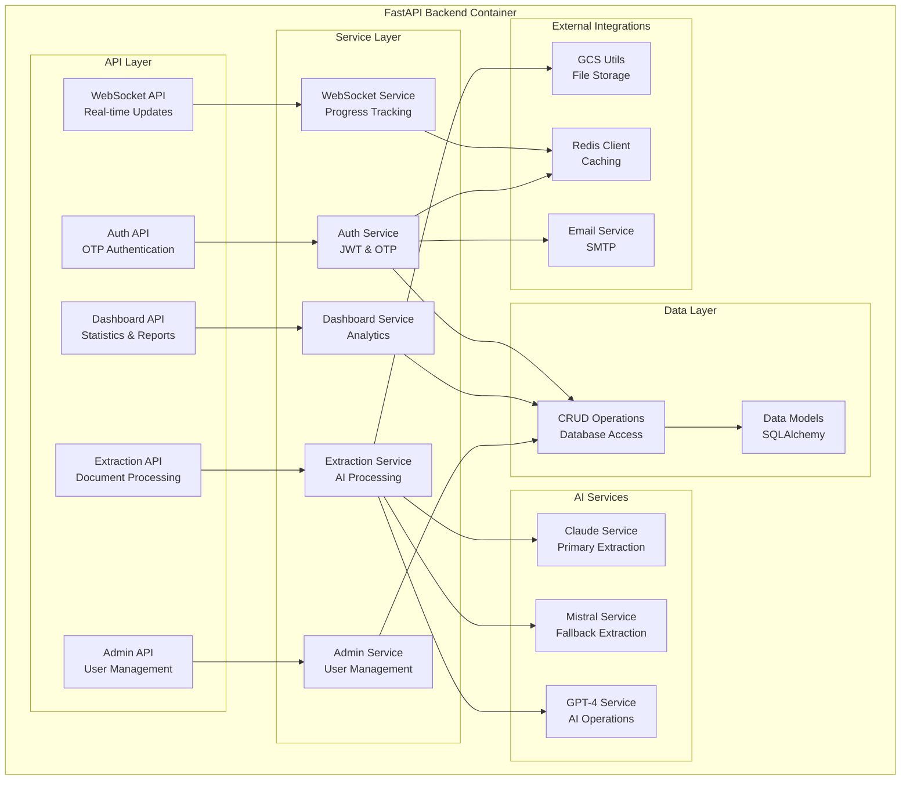
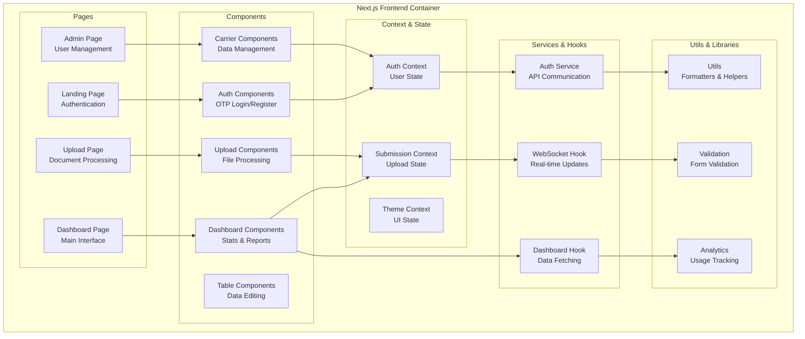
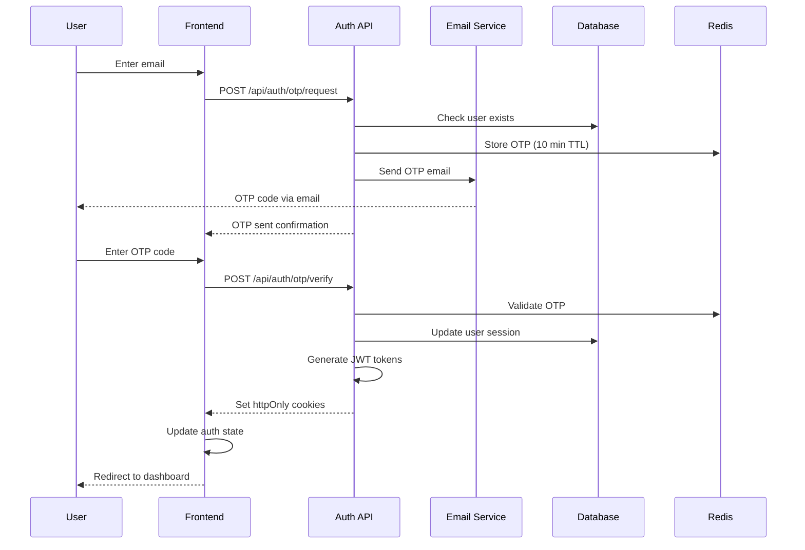
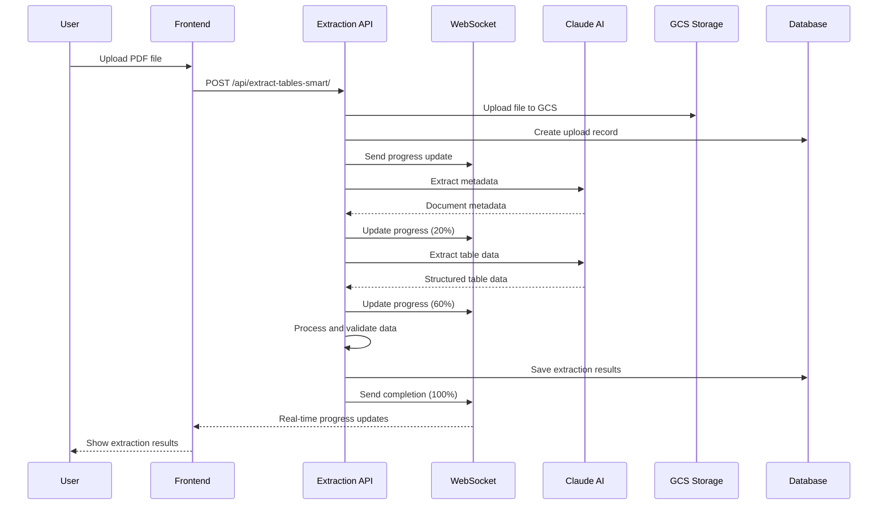

# C4 Models Documentation - Commission Tracker

## Overview

Commission Tracker es una plataforma SaaS profesional para el procesamiento de documentos financieros y seguimiento de comisiones con capacidades de extracción de datos impulsadas por IA.

## Level 1: System Context

### System Context Description

**Primary Users:**
- **Insurance Agents**: Suben documentos de comisiones, revisan datos extraídos, configuran mapeos de campos
- **Brokers**: Procesan múltiples documentos, generan reportes de comisiones, gestionan clientes
- **Administrators**: Gestionan usuarios, configuran dominios permitidos, supervisan el sistema

**External Dependencies:**
- **Email Service (SMTP)**: Envío de códigos OTP y notificaciones
- **AI Services**: Claude Document AI (extracción principal), Mistral (fallback), GPT-4 (operaciones de IA)
- **Cloud Storage (GCS)**: Almacenamiento de archivos PDF y documentos procesados
- **Database (PostgreSQL)**: Persistencia de datos de usuarios, empresas, extracciones y comisiones
- **Redis Cache**: Gestión de sesiones y códigos OTP temporales

## Level 2: Container Diagram

### Container Descriptions

**Frontend Container (Next.js Web App)**
- **Technology**: Next.js 15, React 19, TypeScript, Tailwind CSS
- **Responsibilities**: 
  - Interfaz de usuario para carga de documentos
  - Visualización de datos extraídos
  - Gestión de mapeos de campos
  - Reportes y dashboards
  - Autenticación OTP
- **Key Components**: Dashboard, Carrier Management, Upload Zone, Table Editor

**Backend Container (FastAPI Backend)**
- **Technology**: FastAPI, Python 3.11+, SQLAlchemy, Pydantic
- **Responsibilities**:
  - API REST para operaciones CRUD
  - Procesamiento de documentos con IA
  - Autenticación y autorización
  - WebSocket para actualizaciones en tiempo real
  - Integración con servicios externos
- **Key Modules**: Auth, Extraction, Dashboard, Admin, WebSocket

**Database Container (PostgreSQL)**
- **Technology**: PostgreSQL con asyncpg
- **Responsibilities**:
  - Almacenamiento de datos de usuarios y empresas
  - Metadatos de extracciones
  - Configuraciones de mapeo de campos
  - Datos de comisiones procesadas
- **Key Tables**: users, companies, statement_uploads, extractions, earned_commissions

## Level 3: Component Diagram - Backend API

### Backend Component Descriptions

**API Layer:**
- **Auth API**: Manejo de autenticación OTP, login/logout, gestión de sesiones
- **Extraction API**: Endpoints para procesamiento de documentos, extracción de tablas, mapeo de campos
- **Dashboard API**: Estadísticas, reportes de comisiones, datos analíticos
- **Admin API**: Gestión de usuarios, dominios permitidos, configuraciones del sistema
- **WebSocket API**: Comunicación en tiempo real para progreso de extracciones

**Service Layer:**
- **Auth Service**: Lógica de autenticación, generación de JWT, validación de OTP
- **Extraction Service**: Orquestación del procesamiento de documentos con múltiples servicios de IA
- **Dashboard Service**: Cálculos de estadísticas, agregaciones de datos de comisiones
- **Admin Service**: Gestión de usuarios, permisos, configuraciones
- **WebSocket Service**: Gestión de conexiones WebSocket, notificaciones de progreso

**AI Services:**
- **Claude Service**: Extracción principal usando Claude Document AI (superior precisión)
- **Mistral Service**: Extracción de respaldo usando Mistral Document AI
- **GPT-4 Service**: Operaciones de IA para mapeo de campos, detección de tipos de plan

## Level 3: Component Diagram - Frontend

### Frontend Component Descriptions

**Pages:**
- **Landing Page**: Página de inicio con autenticación OTP
- **Dashboard Page**: Interfaz principal con estadísticas y navegación
- **Upload Page**: Procesamiento de documentos con progreso en tiempo real
- **Admin Page**: Gestión de usuarios y configuraciones (solo administradores)

**Components:**
- **Auth Components**: Formularios de login/registro con OTP
- **Dashboard Components**: Tarjetas de estadísticas, gráficos, modales
- **Upload Components**: Zona de carga, editor de tablas, mapeo de campos
- **Carrier Components**: Gestión de transportistas, visualización de datos
- **Table Components**: Editor de tablas, validación de datos

**Context & State:**
- **Auth Context**: Estado del usuario, permisos, autenticación
- **Submission Context**: Estado de cargas, progreso de extracciones
- **Theme Context**: Tema de la interfaz, preferencias de usuario

## Level 4: Code Diagram - Authentication Flow

## Level 4: Code Diagram - Document Processing Flow

## Technology Stack

### Frontend Technologies
- **Framework**: Next.js 15 (React 19)
- **Language**: TypeScript
- **Styling**: Tailwind CSS
- **State Management**: React Context API
- **HTTP Client**: Axios
- **Real-time**: WebSocket
- **PDF Processing**: PDF.js, react-pdf-viewer
- **Charts**: Chart.js, Recharts
- **UI Components**: Radix UI, Lucide React

### Backend Technologies
- **Framework**: FastAPI
- **Language**: Python 3.11+
- **Database ORM**: SQLAlchemy (async)
- **Database**: PostgreSQL (Render/Supabase)
- **Cache**: Redis
- **Authentication**: JWT + OTP
- **File Storage**: Google Cloud Storage
- **AI Services**: Claude Document AI, Mistral, GPT-4
- **PDF Processing**: PyMuPDF, pdfplumber, Docling
- **Email**: SMTP (aiosmtplib)

### Infrastructure
- **Frontend Hosting**: Vercel
- **Backend Hosting**: Render
- **Database**: PostgreSQL (Render/Supabase)
- **File Storage**: Google Cloud Storage
- **Cache**: Redis
- **Containerization**: Docker

## Key Features

### Document Processing
- **Multi-format Support**: PDF, Excel (XLSX, XLS, XLSM, XLSB)
- **AI-Powered Extraction**: Claude Document AI (primary), Mistral (fallback)
- **Real-time Progress**: WebSocket updates during processing
- **Intelligent Mapping**: Automatic field mapping with AI assistance
- **Quality Validation**: Confidence scoring and data validation

### User Management
- **OTP Authentication**: Secure email-based authentication
- **Role-based Access**: Admin, User, Read-only roles
- **Domain Whitelisting**: Company-specific access control
- **Session Management**: JWT tokens with automatic refresh

### Data Management
- **Commission Tracking**: Monthly breakdowns and analytics
- **Carrier Management**: Multiple insurance carrier support
- **Field Mapping**: Customizable field configurations per company
- **Duplicate Detection**: SHA-256 hash-based duplicate prevention

### Analytics & Reporting
- **Dashboard Analytics**: Real-time statistics and KPIs
- **Commission Reports**: Monthly and yearly commission tracking
- **Data Visualization**: Interactive charts and graphs
- **Export Capabilities**: Data export in multiple formats

## Security Features

- **HTTP-Only Cookies**: Secure token storage
- **CORS Configuration**: Cross-origin request security
- **Rate Limiting**: API endpoint protection
- **Input Validation**: Pydantic model validation
- **SQL Injection Prevention**: SQLAlchemy ORM protection
- **File Type Validation**: Secure file upload handling
- **Session Timeout**: Automatic session expiration

## Performance Optimizations

- **Async Processing**: Non-blocking I/O operations
- **Connection Pooling**: Database connection optimization
- **Caching**: Redis for session and OTP storage
- **File Streaming**: Efficient large file handling
- **Progress Tracking**: Real-time user feedback
- **Timeout Management**: Configurable timeouts for long operations

---

*Esta documentación C4 models proporciona una vista completa de la arquitectura del sistema Commission Tracker, desde el contexto del sistema hasta los detalles de implementación específicos.*
